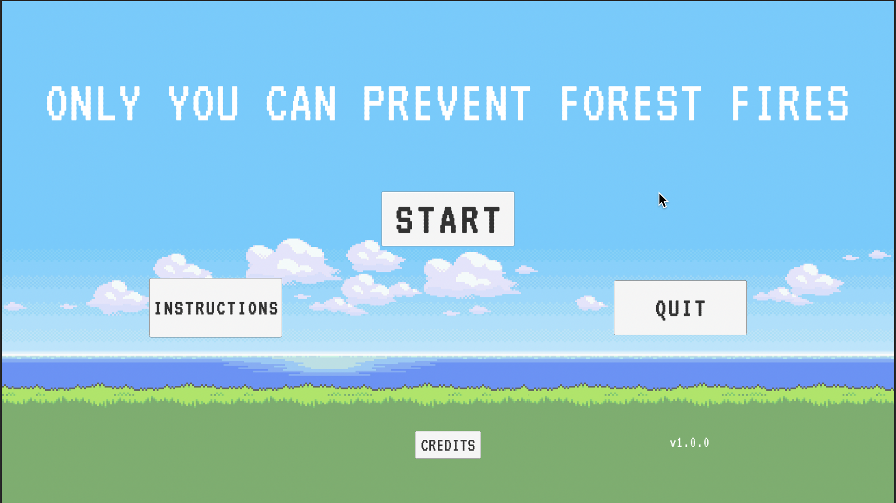
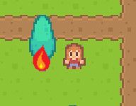
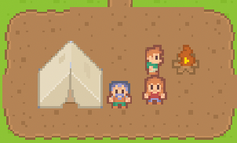
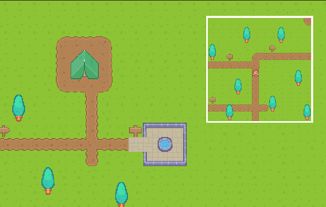
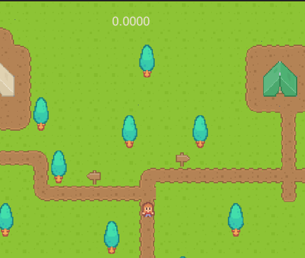
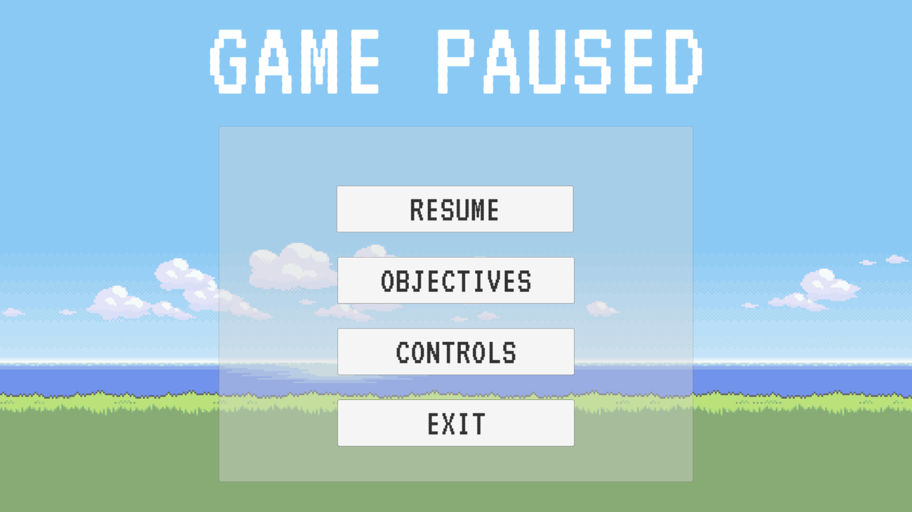

# ONLY YOU CAN PREVENT FOREST FIRES!

For CS4483, developed by: Mathieu Girard, Jason Koo, Nicholas Battel, Junseo Hwang, and Ewhan Han
 
 

## Story

<em>Only You Can Prevent Forest Fires!</em> takes place in modern day where forest fires are becoming more and more prevalent due to public incompetence. Gary Lahey loves nature and became a park ranger so he could focus all his energy into protecting it. Gary was always known as somewhat of a buzzkill, hall monitor type, and he has brought that same personality to the campgrounds. Despite what people think about him, Gary will stop at nothing to ensure that his campgrounds remain in proper order. He spends all his day putting out metaphorical fires such as rowdy campers, drinking, and fishing without a permit while also battling literal fires on the campground.

# How to Play

## How to Start the Game

When you start <em>Only You can Prevent Forest Fires!</em>, you can select the following menu options

**START** - Start the game

**INSTRUCTIONS** - View the controls made available for the game

**QUIT** - Exit the game

**CREDITS** - View the developers of the game

# Game Basics

## End of Game Conditions

The game ends when the player fails to extinguish/ hush an event in the delegated time. The time is indicated by a decreasing coloured bar underneath the tree/ camp.

## Objectives

- Stop the fires that go through the campground by pouring water on any that popup.
- Settle loud and rowdy campers to keep the camp grounds quiet.
- Keep the forest alive and the campground quiet for as long as possible!

# Controls

**W** - Move up

**A** - Move left

**S** - Move down

**D** - Move right

**Spacebar** - Pour water on a fire / hush camper(s)

**Escape** - Pause the game and bring up the pause menu while playing

# Features

## Actions

**Pour water on fire** - Press spacebar when next to an ongoing fire to extinguish it

**Hush loud camper** - Press spacebar when next to a loud camper to silence them.

## HUD Display

### Minimap

Displays a broader view of the game and helps gather information of other sections of the campsite.

### Timer

Displays the total elapsed time since start.

### Time Bar

Represents the remaining time to extinguish/ hush the object before you lose.

## Menus

At the start of the game the player will be greeted by the Start Menu.
Pressing the ESC button while playing will display the Pause Menu.

### Start Menu options
**START** - Will start the game.

**INSTRUCTIONS** - You can find instructions on how to play the game here.

**CREDITS** - View the developers of the game

**QUIT** - Exit the game.

### Pause Menu Options
**RESUME** - Resume the game.

**OBJECTIVES** - You will find a description about the goals in the game.

**CONTROLS** - You will find all the buttons and their functions within the game.

**EXIT** - Exit the game.

# System Requirements

| Specifics  | Recommended                                            |
| ---------- | ------------------------------------------------------ |
| OS         | Windows 10                                             |
| Processor} | Intel Pentium 4 processor or later that's SSE2 capable |
| Memory     | 1 GB RAM                                               |
| Graphics   | Nvidia GeForce GTX 460 or AMD Radeon HD 6870           |
| Storage    | 250 MB available space                                 |
| Additional | No internet connection, No in-game purchases           |

# Imports / Credits

## Music

| Sound      | Source                                                                                            |
| ---------- | ------------------------------------------------------------------------------------------------- |
| Water      | <https://opengameart.org/content/water-waves>                                                     |
| Walking    | <https://opengameart.org/content/grass-foot-step-sounds-yo-frankie>                               |
| Shh        | <https://www.zapsplat.com/music/female-adult-says-shh-as-if-asking-to-be-quiet-1/>                |
| Start Menu | <https://opengameart.org/content/forest>                                                          |
| Background | <https://opengameart.org/content/in-the-forest>                                                   |
| Fire       | <https://opengameart.org/content/spell-4-fire>                                                    |
| Game Over  | <https://www.zapsplat.com/music/8-bit-game-over-80s-arcade-simple-alert-notification-for-game-1/> |

| Image            | Source                                                           |
| ---------------- | ---------------------------------------------------------------- |
| Background Image | <https://wallpaper-mania.com/background/other-wallpapers/8-bit/> |

| Font  | Source                                     |
| ----- | ------------------------------------------ |
| VT323 | <https://fonts.google.com/specimen/VT323/> |

Sprites -
